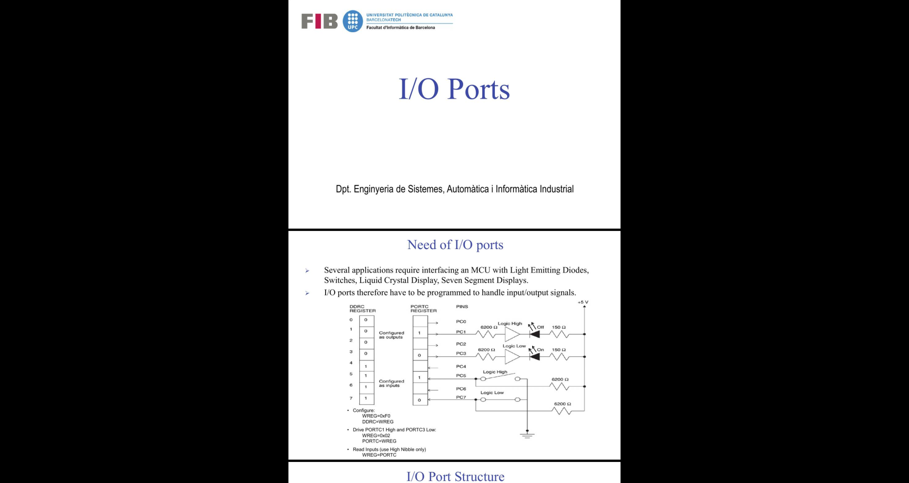

# pdf-cutter

/!\\ Attention: this program only works (by now) on Unix-based OS.

Pdf file cutter for slides where 2 pages are in one of the file

This program converts pdf like this:

To this:

## Usage

`python3 main.py file1.pdf [file2.pdf ...]`

This program allows you to convert more than one pdf file at execution. The
result pdfs are stored on the folder `result/` with the same name than the
original file. All the images used in the conversion are stored at the folder
`images/` and this folder and all its content is deleted at the end of the
execution.

## Requirements

- `pdf2image`
- `img2pdf`

You can install them using the command `pip install -r requirements.txt`

